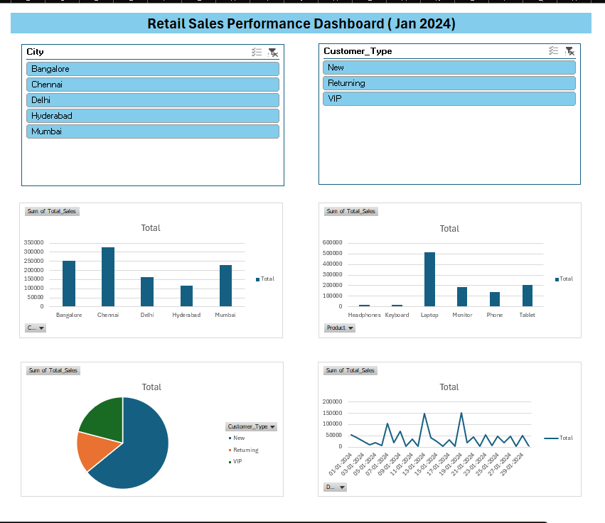

# Retail Sales Dashboard (Excel)

This project analyzes retail sales data for January 2024 using Microsoft Excel.

Key Insights
- Identified top-performing cities  
- Compared revenue across products  
- Analyzed sales distribution by customer type  
- Studied daily sales trends  

Features
- Interactive slicers (City & Customer Type)  
- 4 visualizations in a single dashboard  
- Data cleaned and structured using Excel tables 

Tools used: Microsoft Excel  
Skills demonstrated: Data Cleaning, Pivot Tables, Data Visualization, Dashboard Design

Dashboard Preview

